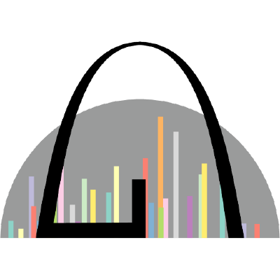

# Pioneer: Fast and Open-Source Analysis of Data-Independent Acquisition Proteomics Experiments

[](LICENSE)
[](https://nwamsley1.github.io/Pioneer.jl/docs/stable/)
[](https://nwamsley1.github.io/Pioneer.jl/docs/dev/)
[](https://nwamsley1.github.io/Pioneer.jl/reports/)
[](https://github.com/nwamsley1/Pioneer.jl/actions/workflows/tests.yml?query=branch%3Amain)
[](https://github.com/nwamsley1/Pioneer.jl/actions/workflows/tests.yml?query=branch%3Adevelop)
[](https://codecov.io/gh/nwamsley1/Pioneer.jl/branch/develop)
[](https://www.biorxiv.org/content/10.64898/2026.02.16.706201v2)

Pioneer is an open-source and performant solution for the analysis of protein mass spectrometry data. Pioneer includes routines for searching data-independent acquisition (DIA) experiments from Thermo and Sciex instruments and for building spectral libraries using the [Koina](https://koina.wilhelmlab.org/) interface. Given a spectral library of precursor fragment ion intensities and retention time estimates, Pioneer identifies and quantifies peptides and protein groups from the library in the data.

**[Documentation](https://nwamsley1.github.io/Pioneer.jl/docs/stable/)** &bull; **[Regression Reports](https://nwamsley1.github.io/Pioneer.jl/reports/)** &bull; **[Landing Page](https://nwamsley1.github.io/Pioneer.jl/)**

## Paper

The Pioneer manuscript is available on bioRxiv:

*Pioneer and Altimeter: Fast Analysis of DIA Proteomics Data Optimized for Narrow Isolation Windows*. bioRxiv (2026).

https://www.biorxiv.org/content/10.64898/2026.02.16.706201v2

## Features

- **Cross-Platform:** Pioneer and the file conversion tool run on Linux, macOS, and Windows.
- **GUI:** The latest release (v0.8.0 and later) ships with a fully functioning graphical user interface.
- **Fast:** Pioneer searches large datasets much faster than they can be acquired and several faster than state-of-the-art search tools.
- **Deep Proteome Coverage:** Pioneer achieves high-sensitivity, FDR control, and both quantitative precision and accuracy on benchmark datasets covering a variety of instruments and parameters. 

## Installation

Download the installer for your operating system from the [releases page](https://github.com/nwamsley1/Pioneer.jl/releases):

| Platform | Installer |
|----------|-----------|
| Windows | `.exe` |
| macOS | `.pkg` (Intel and Apple Silicon) |
| Linux | `.deb` |

The installer adds a `pioneer` command to your `PATH`. On the first run macOS performs a Gatekeeper security check.

```bash
pioneer --help
```

See the [Installation Guide](https://nwamsley1.github.io/Pioneer.jl/docs/stable/user_guide/installation/) for Docker, development setup, and more details.

## Regression Tests

Pioneer maintains a public suite of regression tests across diverse instruments and acquisition schemes. Each tagged release triggers end-to-end searches on real datasets and the results are published as browsable reports.

**[Browse regression reports](https://nwamsley1.github.io/Pioneer.jl/reports/)**

## Contributing

We welcome contributions! Please see our [Contributing Guide](CONTRIBUTING.md) for details on our Git Flow workflow and development process.

## Labs
Pioneer is developed in the [Major Lab](https://majorlab.wustl.edu/) and [Goldfarb Lab](https://goldfarblab.wustl.edu/) at Washington University in St. Louis.

<a href="https://majorlab.wustl.edu/"></a>&nbsp;&nbsp;&nbsp;&nbsp;<a href="https://goldfarblab.wustl.edu/"></a>
<br>

