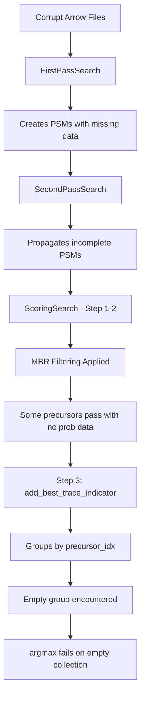

# Empty Collection Error Analysis - CombineTraces Operation

## Executive Summary

The SearchDIA pipeline is encountering an `ArgumentError: reducing over an empty collection is not allowed` error when processing datasets with corrupt or empty MS data files. This error occurs in the ScoringSearch module during the CombineTraces operation, specifically when attempting to find the best isotope trace for each precursor using `argmax` on an empty probability vector.

## Error Stack Trace Analysis

The error originates from:
```
scoring_interface.jl:464 - argmax(p) called on empty collection
└── During transform! operation on grouped DataFrame
    └── Part of add_best_trace_indicator function
        └── Called during ScoringSearch summarize_results!
            └── Step 3 of 23-step ScoringSearch pipeline
```

## Upstream Causes

### 1. Corrupt/Empty Arrow Files in Input Data

**Location**: `/Users/nathanwamsley/Data/MS_DATA/ARROW/SingleCell/250pg/24ms/arrow_out`

Some Arrow files in this directory are either:
- Completely empty (0 rows)
- Corrupt with missing required columns
- Contain only header information without data

These files pass through the initial file validation but produce empty DataFrames when loaded.

### 2. Incomplete Error Handling in Earlier Search Stages

#### FirstPassSearch (Stage 4 of 9)
- **Issue**: When MS data files are corrupt, FirstPassSearch may produce PSM tables with precursors that have no associated probability scores
- **Current Handling**: Creates empty DataFrames with proper schema but doesn't mark precursors as invalid
- **Result**: Empty precursor groups propagate to downstream stages

#### SecondPassSearch (Stage 6 of 9)
- **Issue**: Processes results from FirstPassSearch without validating that each precursor has valid scores
- **Current Handling**: Passes through empty results without filtering
- **Result**: Precursor entries exist in the index but with no associated probability data

### 3. MBR (Match Between Runs) Processing

The error occurs after MBR filtering, which suggests:
```
[ Info: MBR Method Selection:
[ Info:   Threshold: 2328/7531 pass (30.9%)
[ Info:   Probit: 584/7531 pass (7.8%)
[ Info:   XGBoost: 3341/7531 pass (44.4%) ✓
```

MBR successfully processes and filters candidates, but some precursors that pass through have no valid probability scores in their groups, possibly because:
- They were matched across runs but have no data in the current run
- The original file they came from was corrupt
- They represent phantom matches from empty files

### 4. Data Flow Through ScoringSearch

The ScoringSearch pipeline has 23 steps. The error occurs at **Step 3: Best Trace Selection**:

```julia
# Step 1: Model Training ✓ (completes successfully)
# Step 2: Probability Computation ✓ (MBR filtering applied)
# Step 3: Best Trace Selection ✗ (FAILS HERE)
```

The failure happens because:
1. **Step 2** creates probability columns for all precursors, including those from corrupt files
2. When grouped by `precursor_idx`, some groups have no rows (empty groups)
3. **Step 3** attempts to find the best trace using `argmax` on these empty groups

### 5. CombineTraces vs SeperateTraces Logic

The code has two paths based on `IsotopeTraceType`:

```julia
if seperateTraces(isotope_type)
    # SeperateTraces path - groups by [:precursor_idx, :isotopes_captured]
    # Uses set membership check - doesn't fail on empty groups
else
    # CombineTraces path - groups by [:precursor_idx] only
    # Uses argmax - FAILS on empty groups
end
```

The `CombineTraces` path is vulnerable because:
- It groups solely by `precursor_idx`
- Some precursor indices have no associated data rows
- The `argmax` operation has no empty collection protection

## Why This Wasn't Caught Earlier

### 1. Testing Gap
- Most test datasets have complete, valid MS data files
- The test suite doesn't include intentionally corrupt or empty Arrow files
- Integration tests focus on successful pipeline completion

### 2. Recent Changes
Based on git history, the comprehensive error handling commit (23ca9f45) added:
- Failed file tracking to SearchContext
- Empty result creation for each search method
- But didn't add protection for grouped operations within successful files

### 3. Assumption Violations
The code assumes:
- If a file loads successfully, all its precursors have valid data
- Grouped operations will never encounter empty groups
- MBR filtering ensures all remaining precursors have scores

These assumptions break when:
- Files are partially corrupt (load but have missing data)
- MBR creates cross-run references to missing data
- Precursor indices exist without corresponding measurements

## Detailed Data Flow



## Impact Analysis

### Affected Operations
1. **Primary Failure Point**: `scoring_interface.jl:464` - argmax operation
2. **Similar Vulnerable Code**:
   - `utils.jl:85` - `psms[argmax(psms[!,:score]),:best_trace] = true`
   - `utils.jl:1604` - `best_idx = argmax(group.prec_prob)`
   - `SecondPassSearch/utils.jl:1073` - `idx = argmax(group[!, :weight])`
   - `NceTuningSearch/utils.jl:71` - `max_idx = argmax(group[!, :scribe])`

### Pipeline Behavior
- Complete pipeline failure (no results produced)
- 147 warnings generated but not preventing crash
- Unable to process mixed datasets (valid + corrupt files)

## Root Cause Summary

The fundamental issue is a **missing defensive programming pattern** in grouped DataFrame operations. While the pipeline has error handling for failed files at the file level, it lacks protection for empty groups within "successful" file processing. This creates a vulnerability when:

1. Files load but contain incomplete data
2. Cross-run operations reference missing data
3. Grouping operations create empty partitions

The immediate cause is the unprotected `argmax` call, but the deeper issue is that empty precursor groups can reach this point in the pipeline without being filtered or handled appropriately.

## Recommended Solutions

### Immediate Fix
Add empty collection checks before all `argmax`/`argmin`/`maximum`/`minimum` operations:
```julia
if isempty(p)
    return falses(0)  # or appropriate default
else
    # existing argmax logic
end
```

### Long-term Improvements
1. **Input Validation**: Verify Arrow files have required columns AND data
2. **Precursor Validation**: Filter out precursors with no measurements earlier in pipeline
3. **Grouped Operation Safety**: Create helper functions for safe grouped operations
4. **Test Coverage**: Add tests with intentionally corrupt/empty files
5. **Defensive Programming**: Audit all reduction operations for empty collection handling