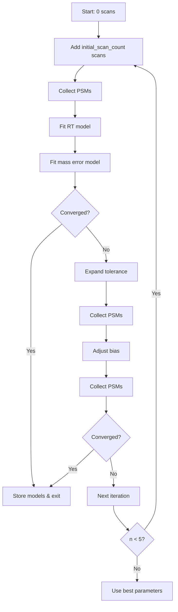

# ParameterTuningSearch Convergence Loop Summary

## Overview

The ParameterTuningSearch convergence loop implements an adaptive, three-strategy approach to determine optimal mass error parameters and retention time alignment. Starting with zero scans and gradually expanding, it efficiently explores the parameter space while minimizing computational cost.

## Key Innovation: Zero-Scan Initialization

The loop begins with an empty `FilteredMassSpecData` structure (0 scans) and incrementally adds scans as needed. This approach:
- Minimizes initial computational overhead
- Allows rapid parameter testing with minimal data
- Expands only when more PSMs are needed for reliable fitting
- Provides better control over convergence behavior

## Convergence Procedure

### Initialization Phase
1. **FilteredMassSpecData Creation**: Start with 0 scans, topN=200 peaks, MS2 only
2. **Initial Parameters**: Use cross-run learning or defaults for mass bias and tolerance
3. **Tracking Variables**: Initialize convergence flags, iteration counters, PSM counts

### Main Loop (up to 5 iterations)

The loop executes three strategies sequentially in each iteration:

#### Strategy 1: Scan Expansion and Collection
```julia
# Calculate scans to add
if n == 0
    additional_scans = params.initial_scan_count  # Default: 2500
else
    current_scans = length(filtered_spectra)
    additional_scans = min(params.expanded_scan_count - current_scans, 2500)
end

# Add scans and collect PSMs
append!(filtered_spectra; max_additional_scans = additional_scans)
psms = collect_psms(filtered_spectra, spectra, search_context, params, ms_file_idx)
```

**Purpose**: Incrementally expand the scan sample to gather more PSMs
**When Applied**: Every iteration, adding more data as needed
**Convergence Check**: After collecting PSMs and fitting models

#### Strategy 2: Mass Tolerance Expansion
```julia
# Expand tolerance by 1.5x
current_tol = (getLeftTol(model), getRightTol(model))
new_tol = current_tol .* 1.5f0
results.mass_err_model[] = MassErrorModel(current_bias, new_tol)
```

**Purpose**: Widen search window when current tolerance may be too narrow
**When Applied**: If Strategy 1 doesn't achieve convergence
**Rationale**: Handles cases where true tolerance exceeds initial estimate

#### Strategy 3: Mass Bias Adjustment
```julia
# Update bias based on observed error distribution
new_bias = getMassOffset(fitted_model)
results.mass_err_model[] = MassErrorModel(new_bias, current_tolerance)
```

**Purpose**: Correct systematic mass offset
**When Applied**: After tolerance expansion if still not converged
**Rationale**: Addresses instrument calibration drift

### Convergence Criteria

The `check_convergence` function evaluates:
1. **PSM Count**: Minimum PSMs collected (default: 1000)
2. **Tolerance Stability**: Relative change < 10% between iterations
3. **Mass Offset Stability**: Change < 2 ppm between iterations

## Data Flow



## Edge Cases Handled

### 1. Low PSM Yield
- **Issue**: Insufficient PSMs for reliable model fitting
- **Handling**: Progressive scan expansion up to `expanded_scan_count`
- **Fallback**: Borrow parameters from neighboring files or use conservative defaults

### 2. Large Mass Bias
- **Issue**: Systematic offset exceeds search window
- **Handling**: Strategy 3 explicitly adjusts bias based on observed errors
- **Detection**: Comparison of fitted vs current bias in each iteration

### 3. Wide Isolation Windows
- **Issue**: Many precursor candidates slow down search
- **Handling**: TopN filtering (200 peaks) reduces complexity
- **Benefit**: Maintains speed even with complex spectra

### 4. Convergence Failure
- **Issue**: Parameters don't stabilize within 5 iterations
- **Handling**: 
  - Use best parameters found
  - Record warnings in diagnostics
  - Apply fallback strategy if needed

## Parameter Configuration

Key parameters controlling convergence:
- `initial_scan_count`: 2500 (first iteration sample size)
- `expanded_scan_count`: 5000 (maximum scans to use)
- `topn_peaks`: 200 (peaks per scan after filtering)
- `max_iterations`: 5 (convergence loop limit)

## Performance Characteristics

### Memory Usage
- **Minimal Initial**: Starts with 0 scans
- **Controlled Growth**: Adds scans only as needed
- **Peak Filtering**: TopN reduces memory per scan by ~80%

### Computational Efficiency
- **Early Termination**: Exits as soon as convergence achieved
- **Parallel Processing**: PSM collection uses multi-threading
- **Smart Sampling**: Random sampling maintains statistical validity

### Typical Convergence Patterns
1. **Simple Samples**: Often converge in iteration 1-2 with initial scans
2. **Complex Samples**: May require 3-4 iterations with tolerance/bias adjustments
3. **Difficult Cases**: Use all 5 iterations, may need fallback parameters

## Diagnostics and Logging

Each iteration logs:
- Scan counts and PSM yields
- Parameter adjustments (tolerance, bias)
- Strategy applications
- Convergence status

Final diagnostics include:
- Number of iterations used
- Final parameter values
- Warnings about any issues
- Cross-run statistics

## Implementation Notes

### Critical Functions
- `collect_psms`: Handles scan index mapping correctly
- `fit_irt_model`: Robust spline fitting with outlier removal
- `fit_mass_err_model`: Quantile-based tolerance estimation
- `check_convergence`: Multi-criteria convergence evaluation

### Future Improvements
1. **Adaptive PSM Thresholds**: Adjust based on sample complexity
2. **Intelligent Bias Search**: Grid search for large bias cases
3. **Dynamic TopN**: Adjust filtering based on scan complexity
4. **Machine Learning**: Predict optimal parameters from initial scans

## Summary

The convergence loop represents a sophisticated approach to parameter tuning that:
- Starts conservatively to minimize computation
- Adapts strategies based on observed data
- Handles diverse edge cases gracefully
- Provides detailed diagnostics for troubleshooting
- Ensures robust parameter estimation across varied datasets

This design enables Pioneer.jl to automatically calibrate critical search parameters without user intervention, making it suitable for high-throughput proteomics workflows.