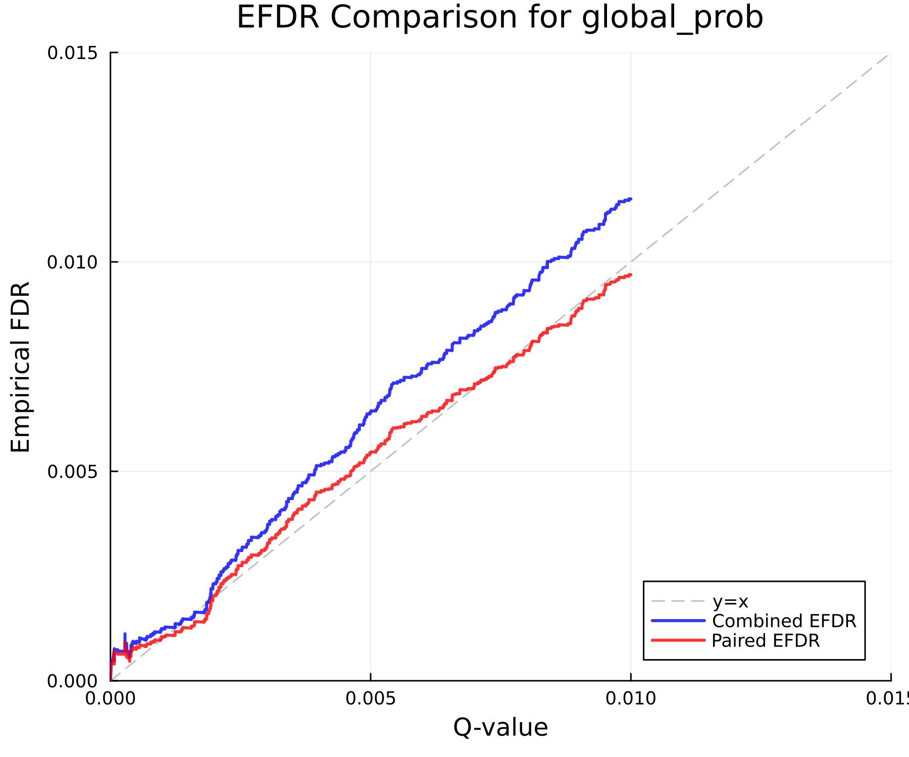
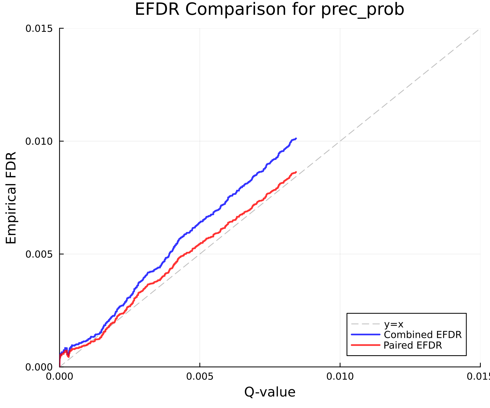

# Empirical FDR Analysis Report

Generated: 2025-07-29T13:06:27.913

## Data Summary

- Original precursor results: 154525
- Analyzed precursor results: 154525
- Library precursors: 3237927

### Library Composition

| Entrapment Group | Count | Percentage |
|-----------------|-------|------------|
| Target (0) | 1618981 | 50.00% |
| Entrapment (1) | 1618946 | 50.00% |

### Results Composition

| Entrapment Group | Count | Percentage |
|-----------------|-------|------------|
| Target (0) | 153743 | 99.49% |
| Entrapment (1) | 782 | 0.51% |

## EFDR Method Comparison

### global_prob / global_qval

| Threshold | Q-val IDs | Actual FDR | Combined IDs | Combined EFDR | Paired IDs | Paired EFDR |
|-----------|-----------|------------|--------------|---------------|------------|-------------|
| 0.001 | 41773 | 0.0006 | 41773 | 0.0012 | 41773 | 0.0011 |
| 0.010 | 52508 | 0.0058 | 52508 | 0.0115 | 52508 | 0.0097 |
| 0.050 | 52508 | 0.0058 | 52508 | 0.0115 | 52508 | 0.0097 |
| 0.100 | 52508 | 0.0058 | 52508 | 0.0115 | 52508 | 0.0097 |

### prec_prob / qval

| Threshold | Q-val IDs | Actual FDR | Combined IDs | Combined EFDR | Paired IDs | Paired EFDR |
|-----------|-----------|------------|--------------|---------------|------------|-------------|
| 0.001 | 123500 | 0.0006 | 123500 | 0.0012 | 123500 | 0.0010 |
| 0.010 | 154525 | 0.0051 | 154525 | 0.0101 | 154525 | 0.0086 |
| 0.050 | 154525 | 0.0051 | 154525 | 0.0101 | 154525 | 0.0086 |
| 0.100 | 154525 | 0.0051 | 154525 | 0.0101 | 154525 | 0.0086 |

## Calibration Analysis

Mean absolute calibration errors:

| Method | Mean Calibration Error |
|--------|----------------------|
| global_prob_combined_efdr | 0.0005 |
| prec_prob_combined_efdr | 0.0005 |
| global_prob_paired_efdr | 0.0004 |
| prec_prob_paired_efdr | 0.0003 |

## Plots

The following plots have been generated:

- 
- 
- 

## Analysis Parameters

- EFDR Methods: Combined, Paired
- Score/Q-value pairs analyzed: global_prob/global_qval, prec_prob/qval
- Output directory: `Users/n.t.wamsley/RIS_temp/PIONEER_PAPER/SPEC_LIBS/entrapment_tests/July29_2025/DecoyThenCharge/results/MtacYeastAlternating3M_altimeter_yeast_shuffEntrap_shuffDecoy_1missedCleavages_fixedNone_mtacAstral_fixedChargeState_Jul152025_Rep1`
