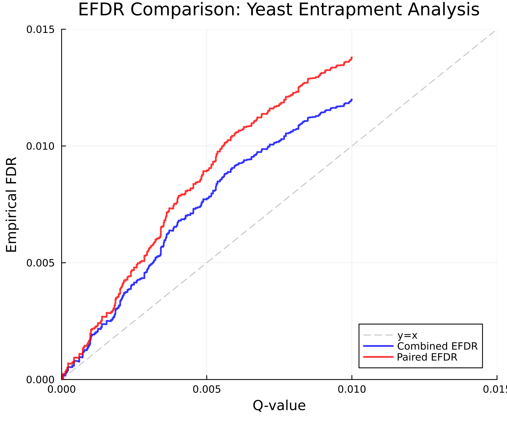
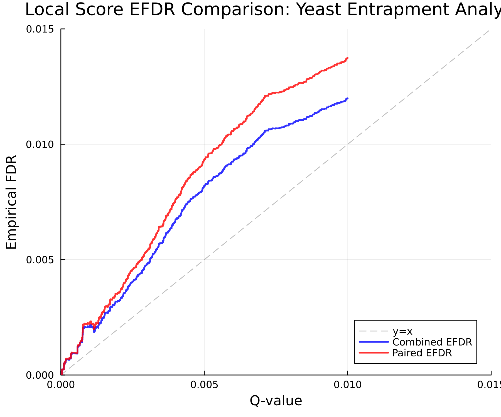
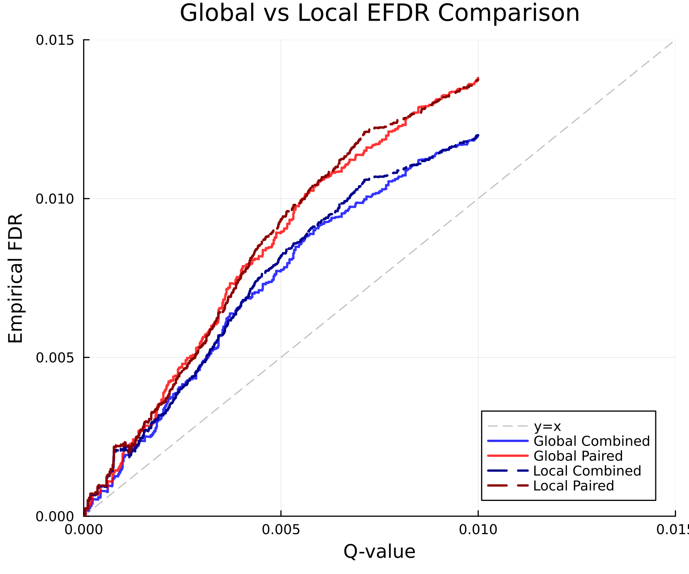

# EFDR Analysis Summary

Date: 2025-06-27T19:59:23.525

## Initial Data Summary

- Total pairs created: 1754698
- Rows without pairs: 0

## After Entrapment Pairing

- Total entrapment pairs created: 1754689
- Rows without entrapment pairs: 10
- Entrapment ratio (r): 1.0

## EFDR Analysis Results

### Global Score Analysis

Creating EFDR comparison plots...

Plots saved:
- 

#### Global EFDR Performance at Standard Thresholds

| Threshold | Q-val IDs | Actual FDR | Combined IDs | Combined EFDR | Paired IDs | Paired EFDR |
|-----------|-----------|------------|--------------|---------------|------------|-------------|
| 0.001 | 98162 | 0.0009 | 98162 | 0.0017 | 98162 | 0.0020 |
| 0.010 | 129406 | 0.0060 | 129406 | 0.0120 | 129406 | 0.0138 |
| 0.050 | 129406 | 0.0060 | 129406 | 0.0120 | 129406 | 0.0138 |

#### Global Calibration Error

Mean calibration error:
- Combined EFDR: 0.0006
- Paired EFDR: 0.0008

### Summary Statistics

- Total precursors analyzed: 129406
- Total entrapment pairs: 1754688

#### Global EFDR at Specific Q-value Thresholds

At q-value threshold 0.001:
- Combined EFDR: 0.0017
- Paired EFDR: 0.002

### Local Score Analysis

Creating EFDR comparison plots for local scores...

Plots saved:
- 

#### Local EFDR Performance at Standard Thresholds

| Threshold | Q-val IDs | Actual FDR | Combined IDs | Combined EFDR | Paired IDs | Paired EFDR |
|-----------|-----------|------------|--------------|---------------|------------|-------------|
| 0.001 | 36463 | 0.0010 | 36463 | 0.0021 | 36463 | 0.0022 |
| 0.010 | 129406 | 0.0060 | 129406 | 0.0120 | 129406 | 0.0137 |
| 0.050 | 129406 | 0.0060 | 129406 | 0.0120 | 129406 | 0.0137 |

#### Local Calibration Error

Mean local calibration error:
- Combined EFDR: 0.0013
- Paired EFDR: 0.0016

#### Local EFDR at Specific Q-value Thresholds

At q-value threshold 0.001:
- Combined EFDR: 0.0021
- Paired EFDR: 0.0022

### Combined Analysis

Creating combined plot with all EFDR curves...

Plots saved:
- 

---

All analysis files saved to: `/Users/nathanwamsley/Projects/Pioneer.jl/test/entrapment_analyses/efdr_out`
