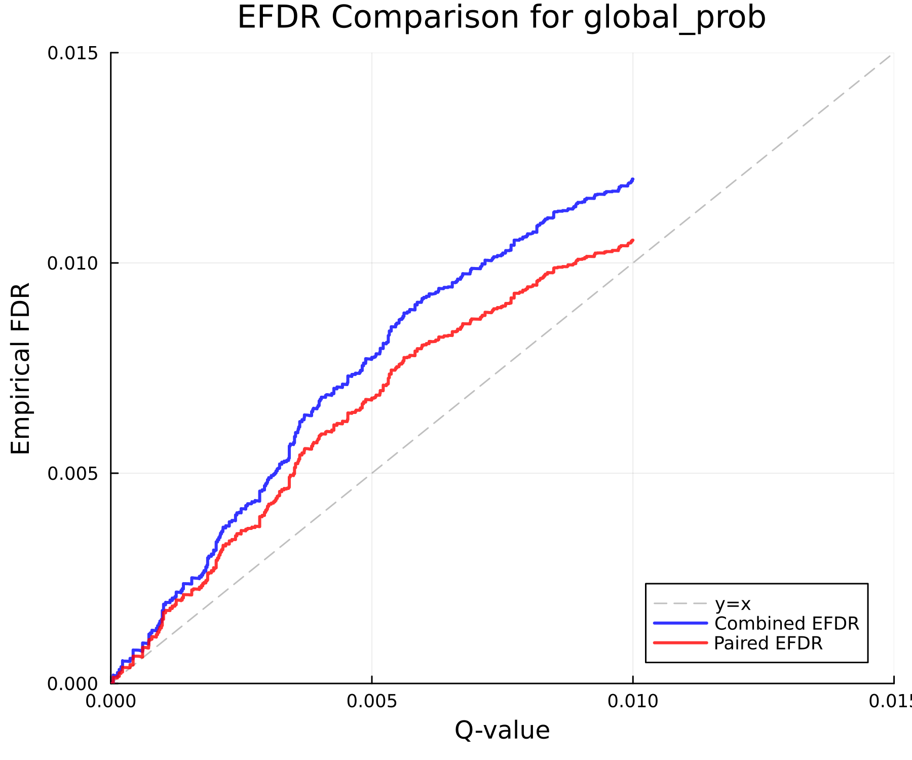
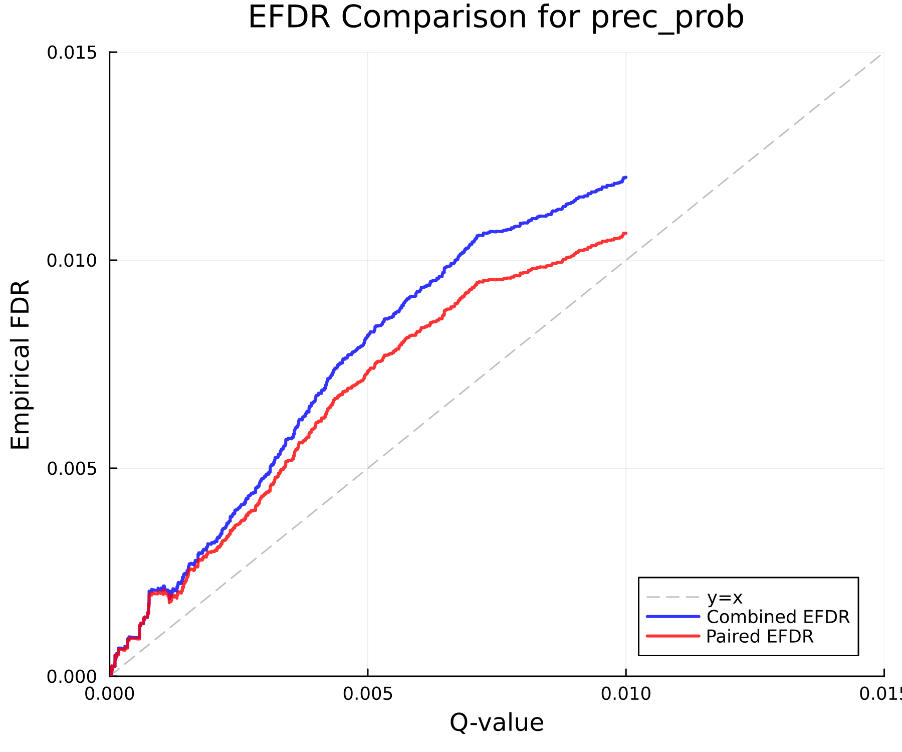
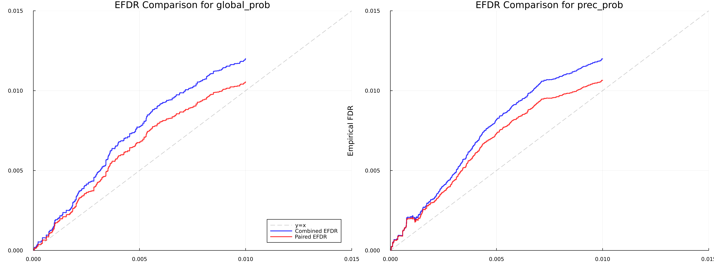

# Empirical FDR Analysis Report

Generated: 2025-06-28T13:43:51.977

## Data Summary

- Original precursor results: 129406
- Analyzed precursor results: 129406
- Library precursors: 3509386

### Library Composition

| Entrapment Group | Count | Percentage |
|-----------------|-------|------------|
| Target (0) | 1754698 | 50.00% |
| Entrapment (1) | 1754688 | 50.00% |

### Results Composition

| Entrapment Group | Count | Percentage |
|-----------------|-------|------------|
| Target (0) | 128630 | 99.40% |
| Entrapment (1) | 776 | 0.60% |

## EFDR Method Comparison

### global_prob / global_qval

| Threshold | Q-val IDs | Actual FDR | Combined IDs | Combined EFDR | Paired IDs | Paired EFDR |
|-----------|-----------|------------|--------------|---------------|------------|-------------|
| 0.001 | 98162 | 0.0009 | 98162 | 0.0017 | 98162 | 0.0015 |
| 0.010 | 129406 | 0.0060 | 129406 | 0.0120 | 129406 | 0.0105 |
| 0.050 | 129406 | 0.0060 | 129406 | 0.0120 | 129406 | 0.0105 |
| 0.100 | 129406 | 0.0060 | 129406 | 0.0120 | 129406 | 0.0105 |

### prec_prob / qval

| Threshold | Q-val IDs | Actual FDR | Combined IDs | Combined EFDR | Paired IDs | Paired EFDR |
|-----------|-----------|------------|--------------|---------------|------------|-------------|
| 0.001 | 36463 | 0.0010 | 36463 | 0.0021 | 36463 | 0.0020 |
| 0.010 | 129406 | 0.0060 | 129406 | 0.0120 | 129406 | 0.0106 |
| 0.050 | 129406 | 0.0060 | 129406 | 0.0120 | 129406 | 0.0106 |
| 0.100 | 129406 | 0.0060 | 129406 | 0.0120 | 129406 | 0.0106 |

## Calibration Analysis

Mean absolute calibration errors:

| Method | Mean Calibration Error |
|--------|----------------------|
| global_prob_combined_efdr | 0.0006 |
| global_prob_paired_efdr | 0.0004 |
| prec_prob_combined_efdr | 0.0013 |
| prec_prob_paired_efdr | 0.0010 |

## Plots

The following plots have been generated:

- 
- 
- 

## Analysis Parameters

- EFDR Methods: Combined, Paired
- Score/Q-value pairs analyzed: global_prob/global_qval, prec_prob/qval
- Output directory: `efdr_output`
